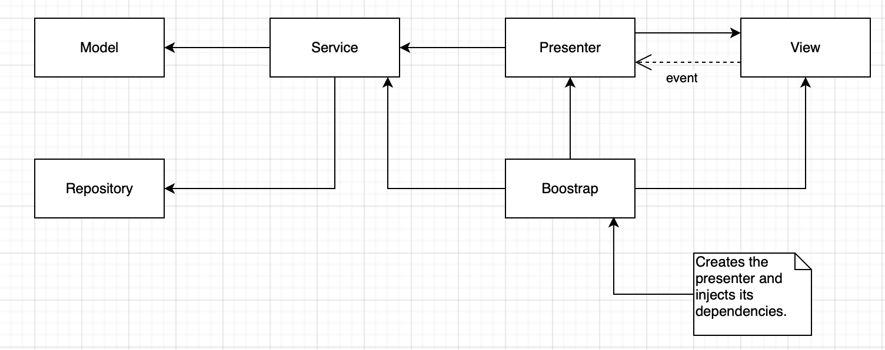

# Log Parser
This program receives a log file and calculates the number
of visits each path has received and display them in order of
number of visits (descending order by default).

## Design

This project was implemented using MVP (Model View Presenter) to separate the different
concerns involved in parsing log information.



## Install

This program is written in Ruby. To execute this program, you will need to install the following gems (libraries in Ruby).
- Bundler
- Active Support
- Rspec

You can do it this way

```bash
gem install bundler
bundle install
```

## Running

### The tests

You can execute the tests by typing the following line.

```bash
bundle exec rake
```

### The program

You can run the program by calling the script directly as follow.

```bash
./parser.rb spec/data/webserver.log
```
